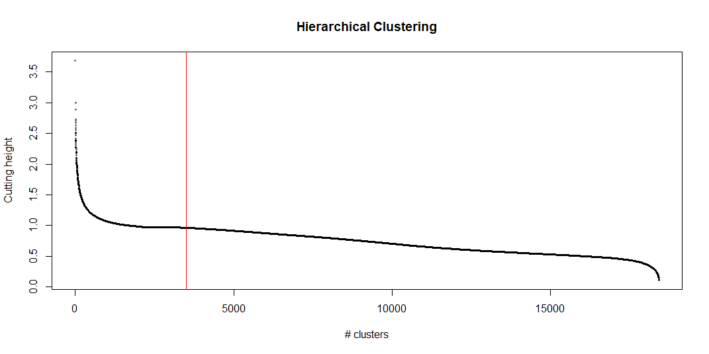
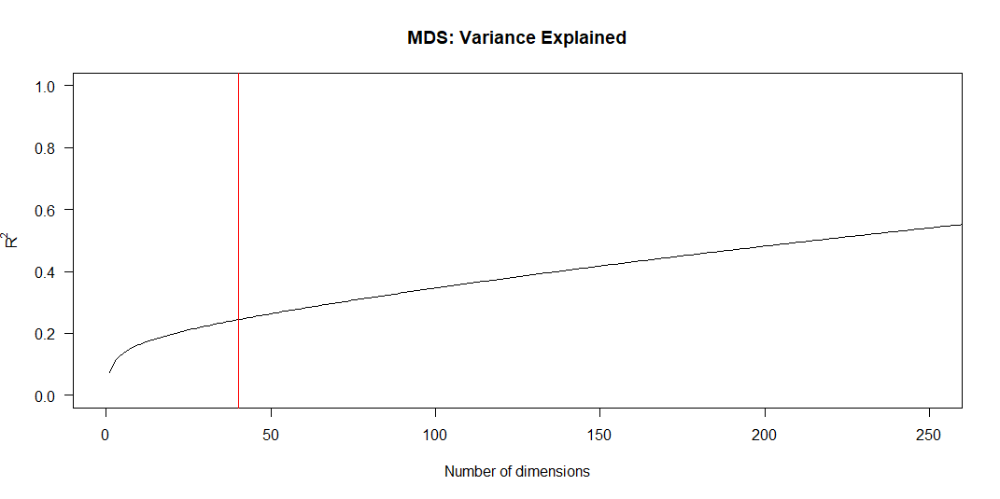

Everything provided as-is. Formal proofs omitted. YMMV... Let's go!

### Theory

###### Assumption 1

> Relative ratings are linear and consistent across users.

E.g. consider the case that

 * User 1 rates Movie 1 at 2.0 and Movie 2 at 3.5, and
 * User 2 rates Movie 1 at 4.5 and Movie 2 at 3.0 

 This implies that both users consider the two movies equally different (1.5),
 even though their preferences for each individual movie is tastily different.

###### Assumption 2

> A user's preference for a single characteristic is differentiable (i.e. exhibits local linearity)

This means a user's preference for a specific characteristic, which is similarly pronounced in
two separate movies, is similarly appreciated. 


###### Definition 1
> The _global taste distance_ _D_ between two movies _m<sub>1</sub>_ and _m<sub>2</sub>_
> is the weighted mean of taste distances across all users, where the weight of each
> user _i_ is inversely proportional to that user's total number of ratings _R<sub>i</sub>_:
	

<!-- D(m_1,m_2) = \frac{\sum_i w_i d_i(m_1,m_2)} {\sum_i w_i} \text{, where } w_i = ln(R_i) / R_i -->


### Step-by-step

I'm no expert when it comes to recommender systems. And there's a lot of data available.
So why not try a model-free approach?

##### 1. Compute global movie-movie distance matrix

Using the user-movie rating dataset [MovieLens 25M](https://grouplens.org/datasets/movielens/25m/)
we compute the global taste distance (See [Definition 1](#definition-1)) for each movie-movie
pair and write the output as a distance matrix.

The per-user weight `ln(R)/R` gives an approximately linear impact on the global space with
each movie rated. Other possible formulations of the weight would either lead to users with
many ratings dominating the shape of the global space, or the other way around. This is
primarily due to the fact that number of movie-movie pairs grows quadratically with the
number of movies.

We limit ourselves to movies with at least 20 ratings (18,430 movies), leading to around
10% of global movie-movie distances being missing. We fill those gaps with the global
mean distance (0.975). For this particular dataset, the mean distance is more accurate than other
missing value imputation methods such as four-point, ultrametric and nearest neighbor approximations.

See the [DataPreprocessor class](../src/main/java/se/motility/linkboy/DataPreprocessor.java) for
more details.

##### 2. Regularization

On its own, the distance matrix represents a very noisy space. To accurately represent
this as a Euclidean space would take almost as many dimensions as movies. To reduce the noise
we employ [Hierarchical Clustering](https://en.wikipedia.org/wiki/Hierarchical_clustering).

We want each cluster to align movies that are similar in the global taste-space. Therefore,
we use complete-linkage clustering to limit the maximum distance between any two movies within
the cluster. We don't want the imputed data to affect our clustering, so we need to select
a cut that is below the global mean distance.



We then compute the cluster-cluster distance matrix. The cluster-cluster distance is taken
as the arithmetic mean distance of all possible movie-movie distances between the movies
in the two clusters. 

##### 3. Unpacking the global taste-space

From the cluster-cluster distance matrix we unpack the top 40 most important dimensions using
[Multidimensional scaling](https://en.wikipedia.org/wiki/Multidimensional_scaling). This means
solving the eigenvalue problem, and it gives us orthogonal dimensions explaining a good amount
of the total variance. This is similar to Principal Component Analysis.  



With only ratings data available, i.e. no genre/tag/metadata whatsoever, we have still managed
to distill the most important characteristics of movies at a global scale. It's of course not
obvious what each dimension represents. But, comparing movies along the two most important ones,
"Dimension 1" and "Dimension 2", we note the following

1. Simple/Dialogue-light/Slapstick <-> Dialogue-heavy/Drama/Complex, and
2. Cheery/Fun/Bright/Happy <-> Dark/Horror/Gore


##### 4. Selecting user subspace

Our hypothesis is that _rating_ is some function of the taste-space. I.e. for some movie
_i_ with a coordinate in the _n_-dimensional taste-space, we have

```
rating = f(mi1, mi2, ..., min)
```

However, each user has their own preferences and the function _f_ is thus highly individual.
A user may not care whether a movie is cheery or dark, as long as it has a special type
of aesthetics. If aesthetics is sufficiently important also to other users, it is most likely
represented as a global taste dimension.

The first thing we do is to reduce the dimension of the domain of the function. Instead of
considering all _n_ dimensions of the global taste-space, we identify the _d_ dimensions in
which the user's preference is likely to vary the most between movies.

Currently, this is done by looking at the variance of _f<sup>-1</sup>_. That is, we find the
dimensions in which the spatial variance is comparably low for each rating. I.e. we group
the movies the user has rated 5.0, the movies they have rated 4.5, and so on. We compute the
squared deviation from mean for each group and compare the sum fot his, to the sum of squared
deviation of all rated movies (not by group). This approach favors dimensions in which the user
has a monotonous preference (since _f_ is surjective). That is, the more a movie exhibits a
preferred characteristic, the better.

We are currently investigating another approach to allow more interesting behavior in _f_.
In particular, we are looking at the 1-dimensional _function variation_ `Σ|f_{k+1} - f_{k}|`, where
_k_ imposes an ordering in the dimension being analysed. I.e. we look at dimensions one at a time
to find dimensions in which the difference in rating between neighboring movies is relatively
low. We employ Monte Carlo-sampling to find the dimension-independent function variation 'baseline'.
By comparing the variation of ordered movies to the baseline, we can see how much of the variation
a dimension explains.

We select the top _d_ dimensions with the highest importance as the user subspace, and scale each
dimension according to how much of the variance it explains.

##### 5. Finding a path

Having identified a _d_-dimensional user subspace and scaled the dimensions according to their
user-based importance, we are now ready to find good paths between movies. 

The key is that we want to move as little as possible in these "perilous" dimensions. One step
in the wrong direction, and we may lose our user's interest. Hence, we want to move with small steps
and in a straight line to minimize the total distance covered.

This is accomplished through a naïve brute-force search of all clusters. In particular, we try to
find _k_ jumps such that each jump has a distance less than `1.5δij/k`, where _δ<sub>ij</sub>_ is the
distance between clusters _i_ and _j_ in the user's own space. The "50% slack" coefficient keeps
jumps small, yet allowing some deviation from the straight line.

We select the path with the smallest total distance. If no such path can be found, try again for
_k-1_ jumps, and so on. We begin with 5 jumps, but this value could well be chosen dynamically.

If we could predict user ratings, we could enhance the pathfinding algorithm to select a path minimizing
both spatial movement and predicted ratings. This is, however, outside the scope for the current
implementation. Instead, we focus on exploiting the assumptions we're already holding. 


 ----

Måns Tegling, 2021
 
